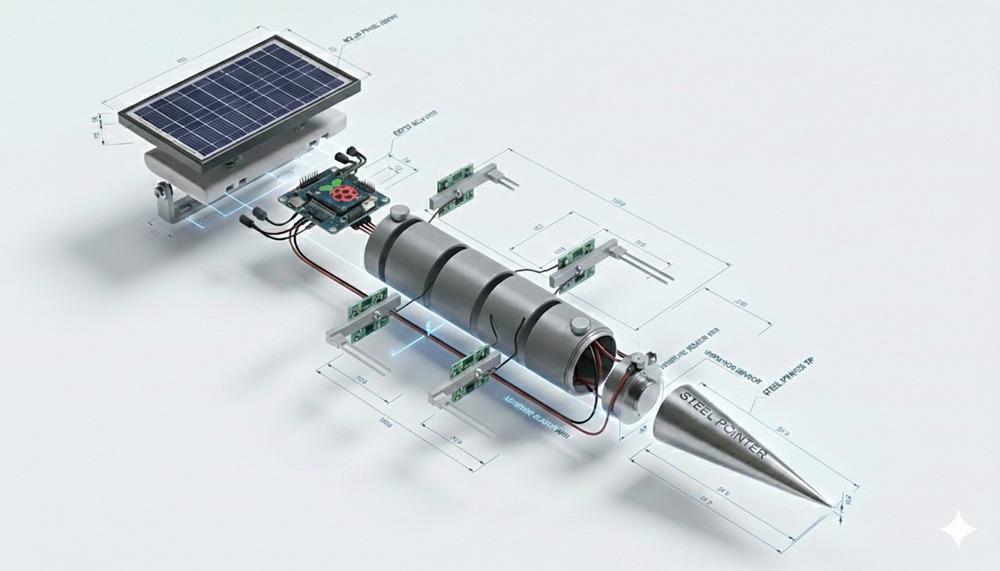
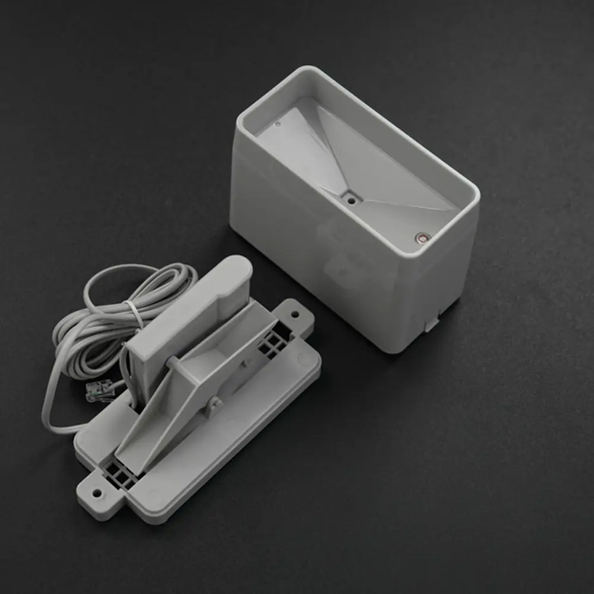
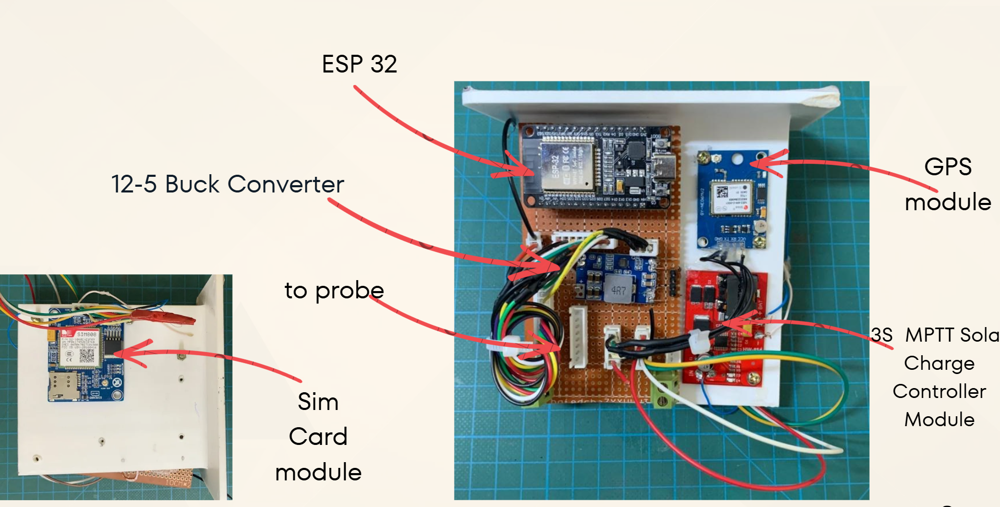

# SlideSense

### AI-Enhanced IoT Landslide Monitoring & Early Warning System

<p align="center">
  
</p>

<p align="center">
  <b>Early Detection. Safe Tomorrow.</b>
</p>

<p align="center">
  
  
  
  
</p>

<p align="center">
  
</p>


## Table of Contents

1. [Introduction](#introduction)
2. [Project Objectives](#project-objectives)
3. [System Overview](#system-overview)
4. [Overall System Architecture](#overall-system-architecture)
5. [Hardware Components](#hardware-components)
6. [Final Hardware Prototype](#final-hardware-prototype)
7. [Data Flow](#data-flow)
8. [Cloud Architecture](#cloud-architecture)
9. [Monitoring Dashboard](#monitoring-dashboard)
10. [Software & Technology Stack](#software--technology-stack)
11. [Testing & Validation](#testing--validation)
12. [Project Timeline](#project-timeline)
13. [Team](#team)
14. [Future Work](#future-work)
15. [Links](#links)


# Introduction

Landslides are a major natural hazard in mountainous and high-rainfall regions of Sri Lanka. Heavy rainfall and increasing soil moisture can gradually reduce slope stability and create potentially dangerous conditions.

**SlideSense** is an IoT-based landslide monitoring and early-warning system developed to continuously observe environmental conditions associated with landslide risk.

The system integrates:

- Multi-depth soil moisture sensing
- Rainfall monitoring
- ESP32-based embedded processing
- GPS positioning
- Cellular communication
- Solar-powered field operation
- AWS cloud infrastructure
- Historical sensor data storage
- Web-based monitoring and visualization
- Risk analysis and early-warning capabilities

SlideSense provides an end-to-end monitoring pipeline from the physical slope to a cloud-connected monitoring dashboard.


# Project Objectives

The main objective of SlideSense is to develop a practical IoT platform capable of continuously monitoring environmental parameters related to landslide risk.

The system aims to:

- Monitor soil moisture at multiple positions below the ground
- Measure rainfall continuously
- Collect and process sensor measurements using an ESP32
- Transmit field data to the cloud
- Store sensor measurements for future analysis
- Visualize real-time and historical data
- Identify potentially dangerous environmental conditions
- Support early-warning mechanisms
- Operate using an independent solar-powered field station


# System Overview

SlideSense consists of four major physical and software subsystems.

### 1. Subsurface Sensor Probe

The sensor probe is inserted into the monitored slope and contains soil moisture sensors positioned at different locations along the probe.

Measurements from multiple sensing points provide a better representation of subsurface soil conditions than a single surface measurement.

### 2. Rainfall Monitoring System

A tipping-bucket rain gauge measures accumulated rainfall.

A Hall-effect sensor detects each bucket tip.

Each tip corresponds to approximately:

> **0.173 mm of rainfall**

The ESP32 counts the detected tipping events and calculates the accumulated rainfall.

### 3. Main Control Unit

The main control unit contains the electronics required for sensor acquisition, communication, positioning, and power management.

The unit integrates:

- ESP32
- GPS module
- SIM / cellular communication module
- Buck converter
- MPPT solar charge controller
- Sensor connections
- Power-management circuitry

### 4. Web & Cloud Platform

Sensor measurements are transmitted to the cloud, where they can be processed, stored, analyzed, and accessed through the SlideSense monitoring dashboard.


# Overall System Architecture

The overall architecture connects the physical monitoring station with cloud services and the user-facing monitoring platform.

<p align="center">
  
</p>


# Hardware Components

| Component | Function |
|---|---|
| **ESP32** | Main embedded controller |
| **Soil Moisture Sensors** | Monitor subsurface soil moisture |
| **Tipping Bucket Rain Gauge** | Measure accumulated rainfall |
| **Hall-Effect Sensor** | Detect tipping-bucket events |
| **GPS Module** | Obtain monitoring-node location |
| **SIM / Cellular Module** | Remote communication |
| **Solar Panel** | Renewable power source |
| **MPPT Charge Controller** | Manage solar charging |
| **Buck Converter** | Regulate supply voltage |
| **Battery** | Store energy for field operation |
| **Sensor Probe** | Houses subsurface sensing elements |
| **Main Control Unit** | Houses control and communication electronics |


# Final Hardware Prototype

## Sensor Probe

<p align="center">
  
</p>

The final SlideSense probe contains multiple soil moisture sensing positions.

The probe is designed to be placed vertically in the monitored ground so that environmental conditions can be measured below the surface.


## Tipping Bucket Rain Gauge

<p align="center">
  
</p>

Rainfall is monitored using a tipping-bucket mechanism.

When the bucket tips, the Hall-effect sensor detects the event and sends it to the ESP32.

The system converts the number of detected tips into accumulated rainfall.

> **Rainfall per tip: approximately 0.173 mm**


## Main Control Unit

<p align="center">
  
</p>

The main control unit integrates the electronic components required for data acquisition and communication.

Major components include:

- ESP32
- GPS module
- SIM / cellular module
- Buck converter
- MPPT solar charge controller
- Probe connection
- Power and sensor wiring


## Solar-Powered Field Station

<p align="center">
  
</p>

The final SlideSense monitoring station combines the main control unit, solar panel, rainfall monitoring equipment, communication hardware, and underground sensor probe.

The solar-powered design allows the monitoring station to operate in locations where conventional power infrastructure may not be available.


# Data Flow

SlideSense follows an end-to-end IoT data pipeline.

```text
Environmental Conditions
          │
          ▼
   Physical Sensors
          │
          ▼
        ESP32
          │
          ▼
 Cellular Communication
          │
          ▼
     AWS IoT Core
          │
          ▼
   Cloud Processing
          │
     ┌────┴────┐
     │         │
     ▼         ▼
 Analysis   Database
     │         │
     └────┬────┘
          │
          ▼
    Web Dashboard
          │
          ▼
  Monitoring / Alerts
```

### Data Processing Steps

1. Soil moisture sensors measure subsurface conditions.
2. The tipping bucket measures rainfall.
3. The ESP32 collects the sensor measurements.
4. GPS information identifies the monitoring-node location.
5. Data is transmitted through the communication system.
6. Telemetry is published to AWS IoT Core using MQTT.
7. Cloud services process incoming measurements.
8. Sensor readings are stored for historical analysis.
9. The dashboard retrieves and displays the data.
10. Risk conditions can be evaluated to support early warnings.


# Cloud Architecture

The cloud layer connects the physical SlideSense field station with the monitoring dashboard.

## AWS IoT Core

AWS IoT Core receives telemetry published by the ESP32 using the MQTT protocol.

It provides the main communication entry point between the deployed monitoring station and cloud services.

## Cloud Processing

Incoming measurements can be processed to:

- Validate sensor readings
- Calculate derived measurements
- Analyze environmental conditions
- Evaluate configured thresholds
- Determine risk levels
- Trigger warning mechanisms

## Data Storage

Sensor readings are stored together with their timestamps.

This enables the system to support both:

**Real-Time Monitoring**

and

**Historical Data Analysis**

Historical measurements are particularly useful for identifying how environmental conditions change over longer periods.


# Monitoring Dashboard

SlideSense includes a dedicated web-based monitoring dashboard.

The dashboard provides a user-friendly interface for viewing and analyzing the measurements collected by the field station.

<p align="center">
  
</p>

## Dashboard Features

### Real-Time Monitoring

The dashboard displays the latest measurements received from the field monitoring station.

### Sensor Charts

Sensor readings are visualized using time-series charts, making environmental changes easier to identify.

### Historical Data

Users can retrieve previously recorded measurements for further analysis.

### Trend Analysis

Current and historical readings can be compared to understand changes in environmental conditions.

### Risk Monitoring

Processed sensor information can be used to present the current environmental or landslide-risk condition.


## Live Dashboard

<p align="center">

[**Open SlideSense Live Dashboard →**](YOUR_DASHBOARD_URL)

</p>


# Software & Technology Stack

## Embedded System

- ESP32
- C / C++
- Arduino Framework
- Sensor interfacing
- MQTT communication
- GPS integration
- Cellular communication

## Cloud

- AWS IoT Core
- AWS Lambda
- DynamoDB
- MQTT

## Backend

- REST API
- Sensor-data retrieval
- Historical-data access
- Cloud integration
- Risk-analysis logic

## Frontend

- Web-based monitoring dashboard
- Responsive interface
- Real-time sensor visualization
- Time-series charts
- Historical data visualization
- Risk-status monitoring

<p align="center">
  
</p>

# Risk Analysis

SlideSense combines multiple environmental parameters to support landslide-risk analysis.

```text
        Soil Moisture
             +
          Rainfall
             +
   Environmental Data
             │
             ▼
       Data Analysis
             │
             ▼
      Risk Evaluation
             │
       ┌─────┼─────┐
       │     │     │
       ▼     ▼     ▼
    NORMAL MODERATE HIGH
             │
             ▼
       Warning System
```

Rather than depending on a single measurement, the system can evaluate multiple environmental conditions together.


# Testing & Validation

Testing was performed progressively from individual sensors to the complete cloud-connected system.

## Hardware Testing

Hardware verification included:

- Power and wiring checks
- Sensor connection testing
- ESP32 operation
- Soil moisture sensor response
- Tipping-bucket operation
- Hall-effect sensor detection
- GPS module communication
- Cellular communication
- Power-management testing
- Solar-system integration

## Soil Moisture Testing

The soil moisture sensors were tested under different moisture conditions.

Water was applied during testing and the corresponding changes in sensor readings were observed to verify sensor response.

## Rainfall Testing

The tipping bucket was tested using controlled water input.

Each physical bucket tip was checked against the corresponding digital event detected by the ESP32.

## Communication Testing

Sensor measurements were transmitted from the ESP32 to the cloud to verify the communication pipeline.

## Dashboard Testing

Cloud-stored measurements were retrieved and displayed through the monitoring dashboard.

## End-to-End Validation

The complete system was tested through the following path:

```text
Sensor
  ↓
ESP32
  ↓
Communication
  ↓
AWS IoT Core
  ↓
Cloud Processing
  ↓
Database
  ↓
Backend
  ↓
Web Dashboard
```

This verifies the complete flow from physical environmental measurement to user-facing visualization.


# Project Timeline

The project was completed through four major development milestones.

### Milestone 01
**Proposal & Planning**

- Problem identification
- Background research
- Initial system architecture
- Component selection

### Milestone 02
**Hardware Development & Testing**

- Sensor testing
- ESP32 integration
- Rainfall monitoring
- Probe development
- Communication testing

### Milestone 03
**Working Prototype**

- Hardware integration
- Cloud communication
- Data storage
- Backend development
- Dashboard development

### Milestone 04
**Final System**

- Final probe assembly
- Main control unit
- Solar-powered monitoring stand
- Dashboard integration
- System testing
- Documentation
- Final demonstration
  

# Team

SlideSense was developed as a Third-Year Project at the **Department of Computer Engineering, Faculty of Engineering, University of Peradeniya**.

| Reg. No. | Team Member | Email |
|---|---|---|
| **E/21/087** | Shihara Dewagedara | [e21087@eng.pdn.ac.lk](mailto:e21087@eng.pdn.ac.lk) |
| **E/21/138** | Fikry M.N.M. | [e21138@eng.pdn.ac.lk](mailto:e21138@eng.pdn.ac.lk) |
| **E/21/302** | Sahandi Perera | [e21302@eng.pdn.ac.lk](mailto:e21302@eng.pdn.ac.lk) |
| **E/21/452** | Zaid M.R.M. | [e21452@eng.pdn.ac.lk](mailto:e21452@eng.pdn.ac.lk) |

<p align="center">
  <b>Department of Computer Engineering</b><br>
  Faculty of Engineering<br>
  University of Peradeniya<br>
  Sri Lanka
</p>


# Future Work

SlideSense provides a foundation that can be extended through future research and development.

Potential improvements include:

- Machine-learning-based landslide-risk prediction
- Sensor-fusion-based risk estimation
- Long-term field deployment and validation
- Deployment of multiple monitoring stations
- Improved weather-resistant enclosures
- Additional geological sensors
- Advanced anomaly detection
- Mobile application development
- Location-based community warnings
- Integration with additional meteorological data
- Improved predictive models using historical datasets


# Links

### Project Website
🌐 [Visit the SlideSense Project Website](YOUR_PROJECT_WEBSITE_URL)

### Live Monitoring Dashboard
📊 [Open the SlideSense Dashboard](YOUR_DASHBOARD_URL)

### GitHub Repository
💻 [SlideSense Source Code](YOUR_GITHUB_REPOSITORY_URL)

---

<p align="center">
  
</p>

<p align="center">
  <b>SlideSense</b><br>
  AI-Enhanced IoT Landslide Monitoring & Early Warning System<br><br>
  Department of Computer Engineering<br>
  Faculty of Engineering<br>
  University of Peradeniya
</p>
